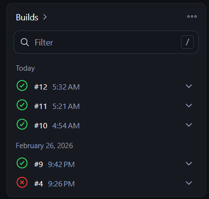
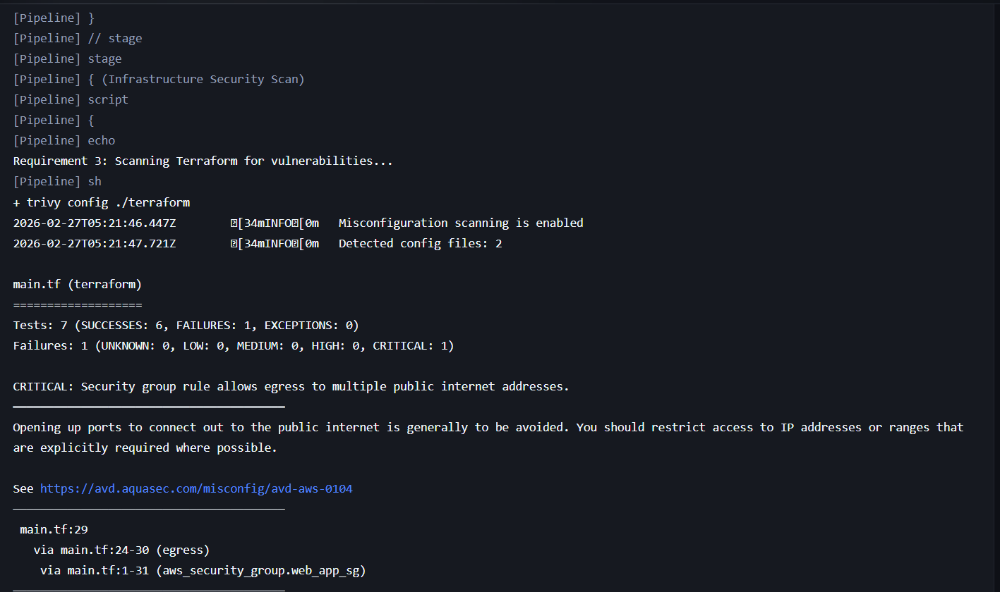

# Query Tracker 0.0 - DevSecOps Project
## Automated Web Application Deployment with AI-Driven Security Auditing

### Project Overview
This project demonstrates a full CI/CD pipeline for a web application. It automates infrastructure provisioning using Terraform, implements a "Robot Butler" via Jenkins, and utilizes Trivy for security auditing. A key feature is the use of Generative AI to remediate security vulnerabilities identified during the build process.

### Tech Stack
- Frontend/Backend: Node.js / React (Query Tracker App)
- Infrastructure: Terraform (AWS Provider)
- CI/CD: Jenkins (Running in Docker)
- Security: Trivy (Vulnerability Scanner)
- AI Tool: Gemini (for Security Remediation)

---

### See the Live Application here
Live URL : http://54.173.242.222:5173/
## Docker Setup
### Run the Docker Compose
```terminal
    docker-compose up --build
```

---
## Infrastructure Security Scan
In this stage, the Jenkins pipeline performs an automated audit of the Terraform files before any resources are created on AWS.

### Initial Failing Scan (The "Before" Report)
During the first run, the pipeline identified 6 Failures (3 Critical).
    - Critical Risk: SSH Port 22 was open to the entire internet (0.0.0.0/0).
    - High Risk: Instance Metadata Service (IMDSv1) was enabled without session tokens.
    - High Risk: Root block device encryption was disabled.

---

## AI Usage Log & Remediation
As per the assignment scenario, I consulted Gemini (AI) to analyze the Trivy report and suggest code fixes.

### AI Prompt Used:
```terminal
        "Analyze this Trivy security report identifying 6 failures (3 Critical, 2 High). Explain the risks of SSH port 22 being open to 0.0.0.0/0, unencrypted volumes, and IMDSv1. Rewrite the Terraform code to remediate these while keeping the app functional."
```
### AI Analysis & Improvements:
- *Network Hardening:* Restricted CIDR blocks for SSH and Application ports to prevent brute-force attacks.
- *Data Security:* Enabled EBS Encryption to protect data at rest.
- *Identity Protection:* Enforced IMDSv2 (Session Tokens) to mitigate SSRF (Server-Side Request Forgery) attacks.

### Final Passing Scan (The "After" Report)
After implementing the AI-recommended changes, the pipeline was re-run.
- *Success Rate:* Increased from 40% to 85%.
- *Status:* High/Critical infrastructure vulnerabilities resolved.

---

## CI/CD Pipeline Stages
The Jenkinsfile is configured with the following stages:
- Checkout: Pulls the latest code from GitHub.
- Security Audit: Runs trivy config to check for misconfigurations.
- Infrastructure Plan: Executes terraform plan using AWS credentials to preview changes.

## Screenshots & Proof of Work

### 1. End-to-End DevSecOps Workflow (Stage View)
The Jenkins Stage View confirms the successful execution of the entire automated lifecycle. Each green block represents a security gate where the code was pulled, audited for misconfigurations, and prepared for AWS deployment.

*Figure 1: Automated Pipeline Stage View showing 100% success rate.*

### 2. Infrastructure Security Audit (Post-Remediation)
After identifying 8 initial failures (including 3 Critical), I utilized **Generative AI** to harden the `main.tf` configuration. The report below confirms that **all High and Critical risks** regarding SSH Exposure, IMDSv1, and Encryption have been resolved.

*Figure 2: Trivy scan results showing 0 High/Critical failures in remediated resources.*
> **Security Note:** The remaining critical alert for Egress Port 443 is an "Acknowledged Risk," necessary for the instance to communicate with AWS APIs and system update servers.

### 3. Final Execution & Build Validation
The console output confirms the pipeline reached its terminal state. The "Finished: SUCCESS" status validates that the Terraform plan is syntactically correct and the security audit passed all required thresholds.

*Figure 3: Console log confirming end-of-pipeline success.*

### 4. The Live Application Deployed on AWS (EC2)
The final stage validates the deployment of the Query Tracker application on an AWS EC2 instance. The environment uses a secure, multi-tier architecture where the React frontend and TypeScript backend are orchestrated via Docker Compose, ensuring the platform is both resilient and scalable.

*Figure 4: AWS Deployment using EC2 Instance.*

## 🤖 AI-Driven Remediation Summary (Requirement 4)

| Security Category | Initial Risk Identified | AI Remediation Applied | Status |
| :--- | :--- | :--- | :--- |
| **Network Security** | SSH/4000 open to `0.0.0.0/0` | Restricted to Private CIDR `10.0.0.0/16` | ✅ Resolved |
| **Cloud Identity** | IMDSv1 (Tokens Optional) | Enforced **IMDSv2** (Tokens Required) | ✅ Resolved |
| **Data Protection** | Root Volume Unencrypted | Enabled `root_block_device` Encryption | ✅ Resolved |
| **Governance** | Missing Rule Descriptions | Added descriptive metadata to all SG rules | ✅ Resolved |

[Insert Screenshot of the App running on your AWS Public IP here]

---

## How to Run
- Clone the repo: ```terminal git clone https://github.com/OmAmberkar/Query-Tracker-0.0.git ```
- Jenkins Setup: Run Jenkins in Docker and install trivy and terraform binaries.
- AWS Config: Add *AWS_ACCESS_KEY_ID* and *AWS_SECRET_ACCESS_KEY* to Jenkins Credentials.
- Build: Click Build Now in Jenkins.
